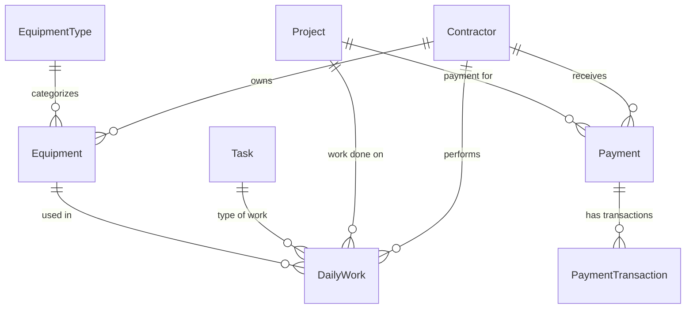

# Construction Management System — Documentation

## Project Overview

The Construction Management System (CMS) is a web-based application designed to manage construction project operations. It provides tools for tracking daily work records, managing contractors and their equipment, processing payments, and organizing projects and tasks. The system supports bilingual usage (Arabic and English) with full RTL layout support, and is built as a frontend-only application that currently operates with mock data in preparation for a future backend integration.

---

## Module Documentation

| Module | File | Status |
|---|---|---|
| [Authentication](./authentication.md) | `authentication.md` | ✅ Complete |
| [Contractors](./contractors.md) | `contractors.md` | ✅ Complete |
| [Equipment](./equipment.md) | `equipment.md` | ✅ Complete |
| [Projects](./projects.md) | `projects.md` | ✅ Complete |
| [Tasks](./tasks.md) | `tasks.md` | ✅ Complete |
| [Daily Work](./daily-work.md) | `daily-work.md` | ✅ Complete |
| [Payments](./payments.md) | `payments.md` | ✅ Complete |
| [Dashboard](./dashboard.md) | `dashboard.md` | ⏳ Placeholder |
| [Reports](./reports.md) | `reports.md` | ⏳ Placeholder |

---

## Technology Stack

### Core

| Technology | Version | Purpose |
|---|---|---|
| React | ^19.1.1 | UI library |
| TypeScript | ^5.9.2 | Static typing |
| Vite | ^7.1.3 | Build tool and dev server |

### UI & Styling

| Library | Version | Purpose |
|---|---|---|
| MUI (Material UI) | ^7.3.2 | Component library (`@mui/material`) |
| MUI Icons | ^7.3.2 | Icon set (`@mui/icons-material`) |
| MUI X Data Grid | ^8.11.2 | Advanced data table component |
| MUI X Date Pickers | ^9.11.0 | Date picker components |
| Emotion | ^11.14.0 / ^11.14.1 | CSS-in-JS engine used by MUI (`@emotion/react`, `@emotion/styled`) |
| Sass | ^1.91.0 | SCSS stylesheets |
| stylis-plugin-rtl | ^2.1.1 | RTL support for Emotion/MUI |
| react-icons | ^5.5.0 | Additional icon set |
| react-select | ^5.10.2 | Custom select/dropdown component |

### State Management

| Library | Version | Purpose |
|---|---|---|
| Redux Toolkit | ^2.9.0 | State management (`@reduxjs/toolkit`) |
| React Redux | ^9.2.0 | React bindings for Redux |
| Redux Persist | ^6.0.0 | Persists auth state to localStorage |

### Forms & Validation

| Library | Version | Purpose |
|---|---|---|
| React Hook Form | ^7.62.0 | Form state management |
| @hookform/resolvers | ^5.2.1 | Schema validation resolvers for React Hook Form |
| Zod | ^4.1.5 | Schema declaration and validation |

### Routing & HTTP

| Library | Version | Purpose |
|---|---|---|
| React Router DOM | ^7.18.2 | Client-side routing |
| Axios | ^1.11.0 | HTTP client (configured, not yet used with a real backend) |

### Internationalization

| Library | Version | Purpose |
|---|---|---|
| i18next | ^26.3.6 | Internationalization framework |
| react-i18next | ^17.0.11 | React bindings for i18next |

### Utilities

| Library | Version | Purpose |
|---|---|---|
| Day.js | ^1.11.21 | Date manipulation and formatting |
| react-toastify | ^11.0.5 | Toast notifications |
| @tanstack/react-table | ^8.21.3 | Headless table utilities |

### Dev Tooling

| Tool | Version | Purpose |
|---|---|---|
| ESLint | ^9.39.0 | Linting |
| Prettier | ^3.6.2 | Code formatting |
| @vitejs/plugin-react | ^5.0.2 | Vite React plugin |
| Volta | Node 22.18.0 / npm 10.9.3 | Node version management |

---

## Project Structure

```
construction-management/
├── public/                          # Static public assets
├── src/
│   ├── app/                         # Application shell
│   │   ├── layouts/                 # Page layouts (AuthLayout, MainLayout)
│   │   ├── providers/               # App-level providers (Redux Provider, PersistGate, ToastContainer)
│   │   ├── router/                  # Route definitions, route constants, guards (ProtectedRoute, PublicRoute)
│   │   ├── routes/                  # Route path exports
│   │   └── store/                   # Redux store configuration (root reducer, persist config)
│   ├── assets/                      # Static assets (images, etc.)
│   ├── components/
│   │   ├── common/                  # (Empty — reserved for shared non-UI components)
│   │   ├── layout/                  # Layout components (Header, Sidebar, Breadcrumb, PageContainer, PlaceholderPage)
│   │   └── ui/                      # Reusable UI components (AppButton, AppInput, AppSelect, AppTable, AppDialog, AppConfirmDialog, AppPageHeader, AppSearchInput, AppDatePicker, EmptyState, etc.)
│   ├── constants/                   # (Empty — reserved for app-wide constants)
│   ├── core/
│   │   ├── api/                     # Axios API client, endpoint definitions
│   │   ├── auth/                    # (Empty — reserved for core auth utilities)
│   │   ├── config/                  # App configuration (API config, constants like APP_NAME, STORAGE_KEYS)
│   │   ├── i18n/                    # i18next initialization and configuration
│   │   ├── routes/                  # (Empty — reserved for core route utilities)
│   │   └── storage/                 # localStorage helper utilities
│   ├── features/                    # Feature modules
│   │   ├── auth/
│   │   ├── contractors/
│   │   ├── daily-work/
│   │   ├── dashboard/
│   │   ├── equipment/
│   │   ├── payments/
│   │   ├── reports/
│   │   ├── settings/
│   │   ├── ui/
│   │   └── users/
│   ├── hooks/                       # Custom hooks (useDialog)
│   ├── locales/                     # Translation files
│   │   ├── ar/                      # Arabic translations
│   │   └── en/                      # English translations
│   ├── shared/
│   │   └── utils/                   # Shared utilities (notify — toast wrapper)
│   ├── styles/                      # Global SCSS styles (abstracts, base, components, layout, main.scss, reactSelectStyles)
│   ├── theme/                       # MUI theme configuration (theme.ts, ThemeProvider.tsx, rtlCache.ts)
│   ├── types/                       # Global TypeScript types (AppRoute)
│   ├── utils/                       # (Empty — reserved for utility functions)
│   ├── App.tsx                      # Root component (wraps AppProviders + AppRouter)
│   └── main.tsx                     # Application entry point (renders App with ThemeProvider)
├── index.html                       # HTML entry
├── vite.config.ts                   # Vite configuration (path alias: @ → src/)
├── tsconfig.json                    # TypeScript project references
├── tsconfig.app.json                # App TypeScript config
├── tsconfig.node.json               # Node TypeScript config (Vite config files)
├── eslint.config.js                 # ESLint configuration
└── package.json                     # Dependencies and scripts
```

### Key Architectural Patterns

- **Path alias**: `@` is mapped to `src/` via Vite config.
- **Feature-based architecture**: Each feature module is self-contained under `src/features/` with its own pages, components, services, types, schemas, and mock data.
- **Layouts**: Two layouts — `AuthLayout` (for login/public pages) and `MainLayout` (for authenticated pages with sidebar, header, breadcrumb).
- **Route guards**: `ProtectedRoute` (requires authentication) and `PublicRoute` (redirects authenticated users to dashboard).
- **State persistence**: Only the `auth` slice is persisted to localStorage via Redux Persist.
- **RTL support**: Full RTL support using `stylis-plugin-rtl`, Emotion cache, and MUI direction config — dynamically switched based on current language.
- **Theme**: Custom MUI theme with Cairo/Roboto fonts, custom palette, rounded components (borderRadius 12–16).

---

## Entity Relationships



---

## Current Project Status

### ✅ Completed Modules (Frontend with Mock Data)

| Module | Status | Notes |
|---|---|---|
| **Authentication** | ✅ Complete | Login page, Redux auth slice, mock login service, route guards |
| **Contractors** | ✅ Complete | Full CRUD with table, dialogs, delete confirmation, mock data |
| **Equipment** | ✅ Complete | Full CRUD linked to contractors & equipment types, mock data |
| **Daily Work** | ✅ Complete | Full CRUD with project/contractor/equipment/task selection, cost/deduction tracking, mock data |
| **Payments** | ✅ Complete | Payment listing, filtering, details dialog, record payment, payment summary, mock data |
| **Settings — Equipment Types** | ✅ Complete | Full CRUD with bilingual names, mock data |
| **Settings — Projects** | ✅ Complete | Full CRUD, mock data |
| **Settings — Tasks** | ✅ Complete | Full CRUD with bilingual names, mock data |
| **UI State** | ✅ Complete | Sidebar toggle via Redux |
| **Internationalization** | ✅ Complete | Arabic (default) and English, with full RTL support |
| **Theming** | ✅ Complete | Custom MUI theme, RTL cache, direction-aware rendering |
| **Shared Components** | ✅ Complete | Full library of reusable UI components (AppButton, AppTable, AppDialog, AppInput, AppSelect, etc.) |
| **Layout** | ✅ Complete | Header, Sidebar (with navigation), Breadcrumb, PageContainer |
| **API Client** | ✅ Complete | Axios client configured with interceptors (Bearer token), not yet connected to a real backend |

### ⏳ Pending / Placeholder Modules

| Module | Status | Notes |
|---|---|---|
| **Dashboard** | ⏳ Placeholder | Displays a placeholder page; a prototype `DashboardPage.tsx` exists but is not routed |
| **Reports** | ⏳ Placeholder | Displays a placeholder page only; no services, components, or data |
| **Users** | ⏳ Not Started | Empty directory; no pages, services, or types |
| **Settings Hub** | ⏳ Placeholder | The main `/settings` page is a placeholder; sub-modules (Equipment Types, Projects, Tasks) are fully implemented and routed independently |

### 🔜 Backend Integration (Not Yet Started)

- All feature services currently use **mock data** (local arrays) instead of real API calls.
- The Axios API client is configured and ready (`src/core/api/`) with Bearer token interceptors.
- API endpoints are partially defined (`/auth/login`, `/auth/logout`, `/auth/me`, `/dashboard/summary`).
- Environment variable `VITE_API_BASE_URL` is supported for configuring the backend URL.

---

## Documentation Rules

Each module has its own documentation file under `docs/`.

Documentation must be updated whenever:
- A new module is implemented.
- An important business rule changes.
- A backend-relevant relationship or behavior changes.

Future updates must:
- Preserve existing documentation.
- Update only the relevant module documentation.
- Document important business rules and relationships.
- Document backend-relevant information.
- Never invent behavior that does not exist in the frontend.
